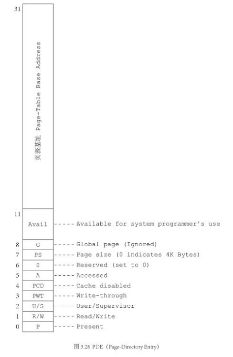

# 分页

## 概念

分页机制是一种内存管理机制,能够提供便捷的虚拟地址映射功能.

80386中页的大小固定为4KB,Pentium中还可以为2MB或4MB

## 与分段的关系

段与页,都是内存管理机制,但两者互相独立.

对于代码来说,都是按照段的形式进行管理;页对于程序是透明的.

逻辑地址 _(代码中的地址)_ -- 段机制 --> 线性地址 -- 分页机制 --> 物理地址

## 实现

### 理论

对于一个程序中的地址,我们称为 ```逻辑地址```,经过 ```段机制``` 的转换,生成了 ```线性地址```.

分页机制就是作用于 ```线性地址``` 和 ```物理地址``` 之间的.

分页机制使用 ```线性地址``` 的高位,通过某种规则,从 一张表 _(映射表)_ 中找到对应的 ```物理地址``` 的高位, 与 ```线性地址``` 的地位相加, 生成物理地址.

### 实现

通常,分页机制使用两级 ```映射表``` 进行转换,分别叫做 __页目录表__ 和 __页表__

对于线性地址,进行转换时,划分为三份,分别作为页目录表中的index寻找页表的地址/作为页表中的index寻找页地址的基地址/作为页内偏移地址

__通过cr0寄存器的PG位指示是否开启分页机制__

#### 页目录表

- 页目录表中存储着1024个页表的地址
- 显然,页目录表大小为4KB,正好为一页
- 页目录表存储在cr3寄存器

#### 页表

- 页表的每个表项是一个页的物理地址
- 每个页表存储1024个页表项
- 显然,每个页表的大小为4KB,正好一页

#### PDE 和 PTE 的结构



_Orange'S 一个操作系统的实现 图3.28_


_Orange'S 一个操作系统的实现 图3.29_

- ```P```       存在位
- ```R/W```     读写权限位 
- ```U/S```     特权级位 (user/supervisor)
- ```PWT```     缓冲策略(写回/通写)
- ```PCD```     控制缓冲是否开启
- ```A```       指示是否被访问过
- ```D```       指示是否被写入过
- ```PS```      决定页的大小
- ```G```       全局页

#### cr3

```cr3``` 指向页目录表的控制寄存器,又被称为Page-Directory Base Register

## 中英对照

- 页目录      page directory
- 页表        page table
- 页目录表项  page directory entry PDE
- 页表项      page table entry PTE

## 参考
- _x86汇编语言:从实模式到保护模式_
- _Orange'S 一个操作系统的实现_
