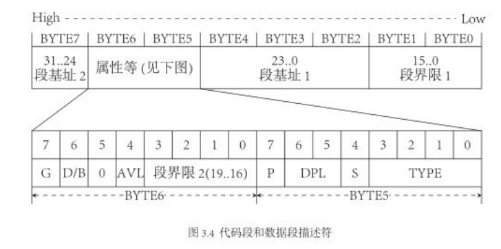
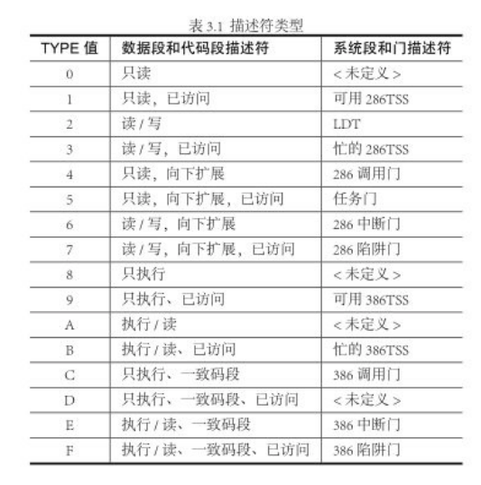

# 保护模式 _protected mode_

IA32架构下,处理器有两种工作模式,分别是保护模式和实模式.当系统加电后,工作于实模式下,通过修改cr0寄存器的0位,可以修改cpu的工作模式为保护模式

## 实模式 _real mode_

### 寻址

实模式下的寻址如同8086的寻址方式类似,通过段基址和偏移量实现了16位cpu和寄存器寻址20位地址线的功能

```
address = (addr_base < 4) + addr_offset
```

## 保护模式与实模式

- 8086/8088,16位CPU,20位地址线,无保护模式
- 80286,16位cpu,24位地址线,有保护模式
- 80386,32位cpu,32位地址线,有保护模式

保护模式主要提供了段间的访问保护机制和更大的寻址空间

### 构造

#### 寄存器

- IA32将8个16位通用寄存器扩展为32位 _AX -> EAX .. etc_
- 同样的,控制寄存器 IP 和 FLAGS 也被扩展为 EIP 和 EFLAGS
- 4个段寄存器 _CS DS SS ES_ 被扩展为32位,同时不在装载段基址,而是段选择子 _Selector_;新增两个段寄存器 _FS GS_

#### 地址线

同样的,32位地址线在保护模式下能够被全部利用,实现32位地址的寻址 _4GB_

### 寻址

使用段寄存器中的 _段选择子 selector_ 从 _GDT 或者 LDT_ 中获得 _段描述符 Descriptor_ 和 偏移量 读取内存

## GDT 与 LDT

G(lobal)D(escriptor)T(able) 全局描述符表
L(ocal)D(escriptor)T(able) 局部描述符表

顾名思义,是存储 _描述符 Descriptor_ 的表

### Descriptor 描述符

#### 结构



_Orange'S 一个操作系统的实现 图 3.4_

- 64位
- 分散的段基地址和段界限是为了兼容80286的历史原因
    - 80286是16位cpu,24位地址线时创立的保护模式
    - 80386时32位cpu,32位地址线,兼容了80286的保护模式
- 标志位的含义
    - G 粒度 0-1byte为单位 1-4KB为单位
    - S 描述符类型 0-系统段 1-代码段或堆栈段
    - DPL 描述符特权级 定义为 __访问该段需要的最低特权级__
    - P 段存在位 表明该段是否存在于内存中
    - D/B
    - L 
    - TYPE 描述符子类型

        
        
        _Orange'S 一个操作系统的实现 表3.1_

        - TYPE共四位 (3,2,1,0)
        - 最高位 _3_ 为X,表示是否允许执行
        - _2_ 位 为扩展方向(数据段) 或者 是否为特权级依从/一致代码段(代码段)
        - _1_ 位 为是否可写(数据段) 或者 是否可读(代码段)
        - _0_ 位 是否(近期)访问过

## 段选择子 Selector

__保护模式中,段寄存器中保存的不再是段基址,而是段选择子__

段选择子包括了要访问的段的 descriptor/在GDT中还是LDT中/RPL

## 参考
- _Orange'S 一个操作系统的实现_
- _x86汇编语言 从实模式到保护模式_
- _Modern Operate System_
