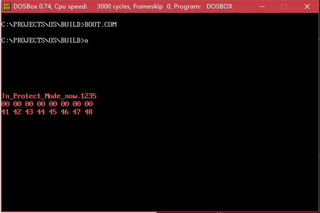

# EOS
## build img
1. 修改boot.bxrc中的路径
    1. romimage
    1. vagromimage
    1. floppya
1. ```make```
1. 启动bochs
## build com
1. ```make boot.com```
1. 使用任意方法通过dos执行
## 遇到的问题
### 保护模式
1. **no bootable device** 就是生成的镜像里面 没有符合约定的将510处置为0xaa55
1. **mount failed unknown error** <del>我使用的是win10的ubuntu子系统 *16.04*，生成的img没法成功挂载。没能解决，我通过使用 **dosbox** 来模拟了dos环境，直接运行了生成的com， 效果拔群。</del> **dosbox不支持中断15h 来读取内存** 我通过租的服务器来实现了挂载写入，最后还是用了bochs。

